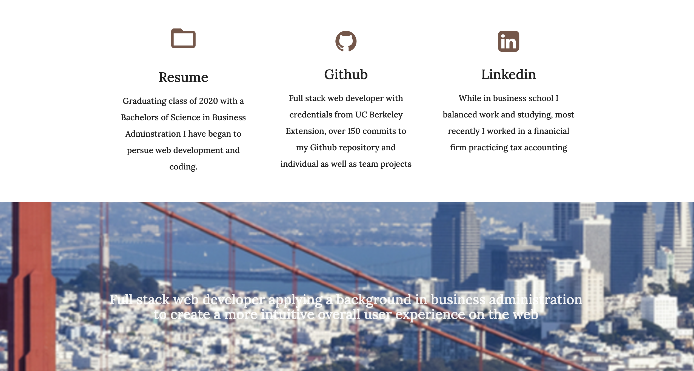
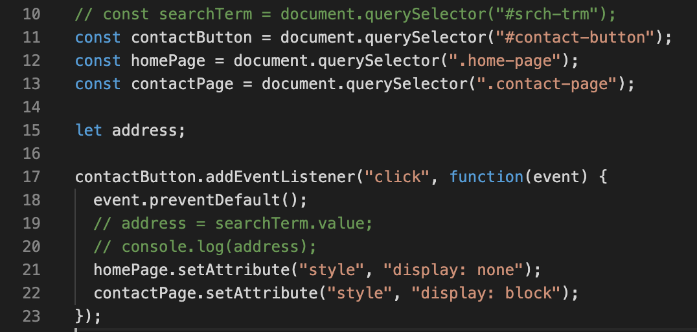
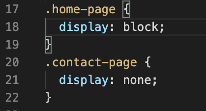
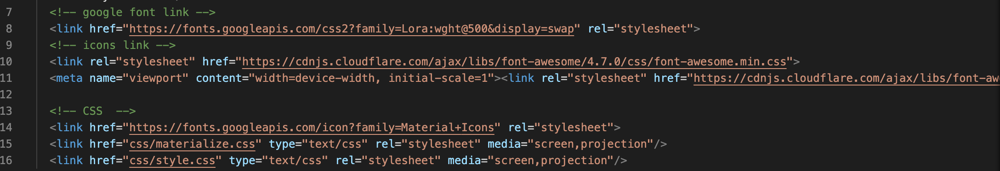

# Portfolio
Building my profesional protfolio to become employer ready and competitive, links to my Github, Linkedin, Resume, social media and contact information. 



## Table of Content
- Objective
- Deploy Link
- Getting Started
- Code Highlights
- Author 

## Objective
Build a unique app that displays at least three projects with links to them, make sure all READMES are polished and employee ready as well as the apps themselves. Add links to Github, Linkedin, a reume pdf, Medium and social media and write out a short 'about me' section. Include contact information. 

## Deploy Link
https://ayladillis.github.io/ayladillis_portfolio/ 

## Getting Started
These instructions will get you a copy of the project up and running on your local machine for development and testing purposes. See deployment for notes on how to deploy the project on a live system.

```
$ git clone git@github.com:ayladillis/ayladillis_portfolio.git
ayladillis/ayladillis_portfolio.git
$ cd ayladillis/ayladillis_portfolio.git
```
Then open in your preferred text editor:
- [vim](https://www.vim.org/) 
- [emmacs](https://www.gnu.org/software/emacs/)
- [visual studio code](https://code.visualstudio.com/) 

## Code Highlight
Here I set up variables for the contact button, the home page and the contact page which are both divs wrapping the entire segment of code making up each page. Then using the event listener click function to change the style of display to 'none' for the home page and 'block' for the contact page. 




I used Materialize CSS to build my portfolio then I added a unique font with Google Font API and added icnons with the Google Icon API. 



## Technology
* [HTML](https://developer.mozilla.org/en-US/docs/Web/HTML)
* [CSS](https://developer.mozilla.org/en-US/docs/Web/CSS)
* [Javascript](https://developer.mozilla.org/en-US/docs/Web/JavaScrip)
* [JQuery](https://jquery.com/)

## Authors 
- [Ayla Dillis](https://github.com/ayladillis)